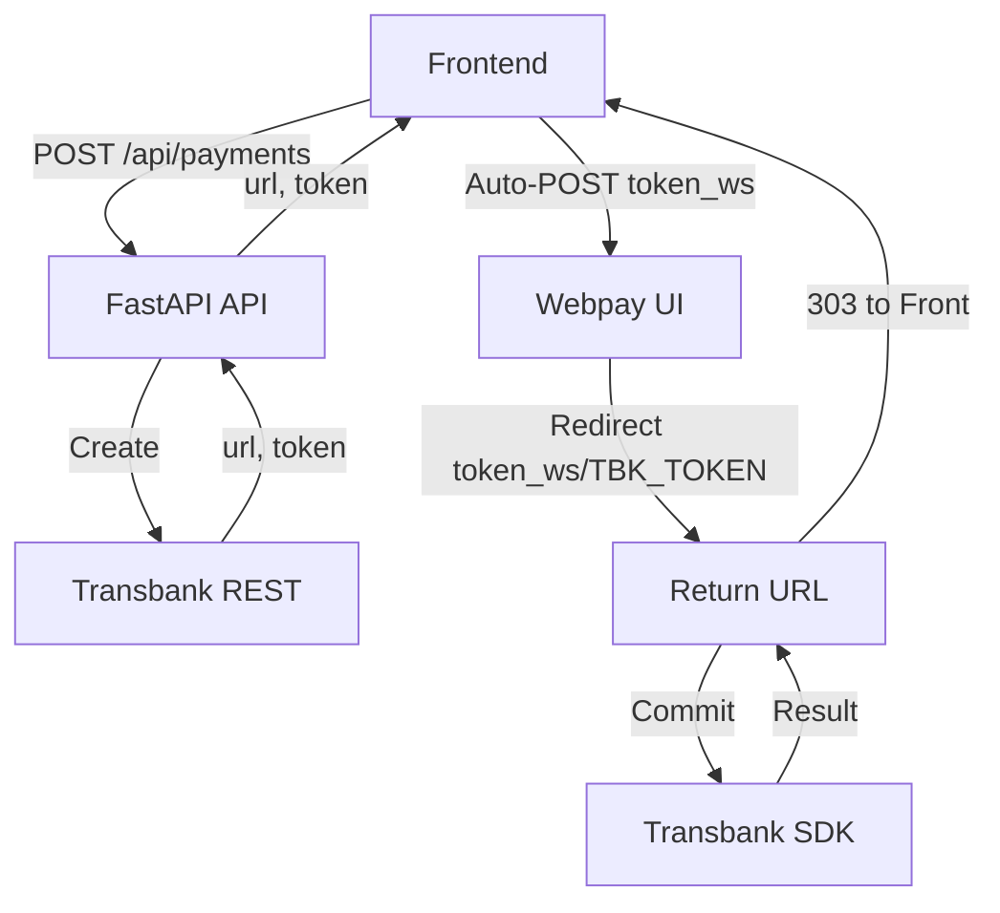
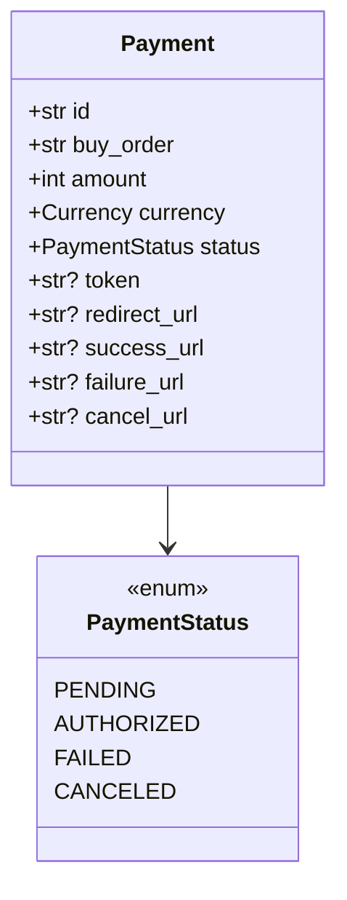
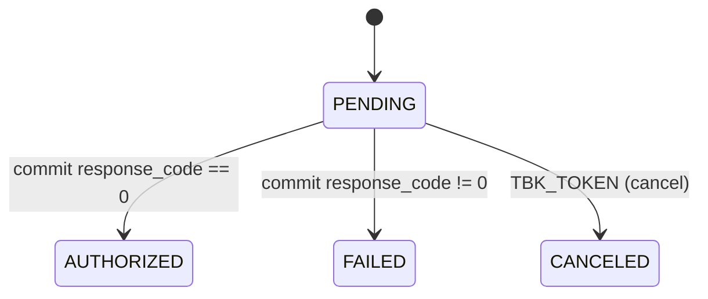
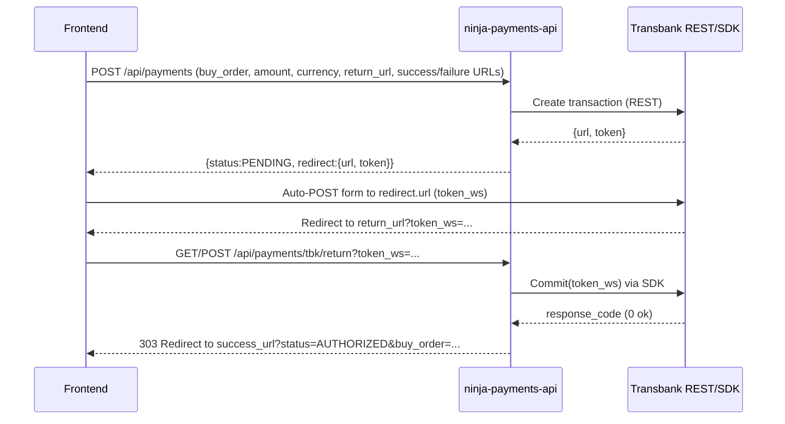
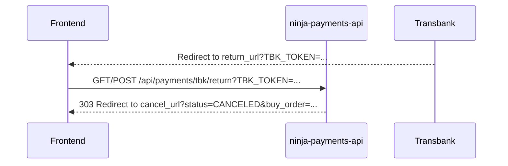

# ninja-payments-api

FastAPI service exposing a minimal payments API using Transbank Webpay Plus.

## Setup

```bash
python -m venv .venv
source .venv/bin/activate || .\.venv\Scripts\activate
pip install -r requirements.txt
cp -n .env.example .env 2>/dev/null || copy .env.example .env
```

## Usage

Create a payment:

```bash
curl -X POST http://localhost:8000/api/payments \
  -H 'Authorization: Bearer testtoken' \
  -H 'Content-Type: application/json' \
  -d '{"buy_order":"o-123","amount":1000,"currency":"CLP","return_url":"http://localhost:8000/api/payments/tbk/return","success_url":"http://localhost:3000/checkout/success","failure_url":"http://localhost:3000/checkout/failure","cancel_url":"http://localhost:3000/checkout/canceled"}'
```

The response contains a token and redirect URL. A minimal auto-post form looks like:

```html
<form id="pay" action="https://webpay.example/" method="POST">
  <input type="hidden" name="token_ws" value="TOKEN" />
</form>
<script>document.getElementById('pay').submit();</script>
```

Transbank will call `/api/payments/tbk/return` with `token_ws` (authorized/failed) or
`TBK_TOKEN` when the user cancels. If you provide `success_url`, `failure_url`,
or `cancel_url`, the API will redirect the browser (303) to those URLs appending
`status` and `buy_order` as query parameters. Otherwise, the API returns a JSON
with the final status.

## Tests

```bash
pytest
```

## Overview

This service exposes a small, opinionated API to create payment transactions against Transbank Webpay Plus (integration environment), handle the browser return from Webpay, and report the final status back to the client. It favors simplicity and clear flows suitable for demos, PoCs, and local development.

Key traits:
- Minimal endpoints: create payment and handle the return.
- Real calls to Transbank integration for creation and commit.
- Optional frontend redirects after return (success/failure/cancel).
- Simple in‑memory store for payment state (ephemeral, dev‑only).
- Bearer token authentication for the create endpoint.
- JSON logging for easy parsing.

## Architecture



Components:
- App: `app/main.py` wires routers and logging.
- Routes: `app/routes/health.py`, `app/routes/payments.py`.
- Service: `app/services/payments_service.py` contains business rules.
- Provider: `app/providers/transbank_webpay_plus.py` does REST create + SDK commit.
- Store: `app/repositories/memory_store.py` keeps state per token in RAM.
- Config: `app/config.py` (Pydantic v2 settings; extra env vars are ignored).

## Domain & Statuses



State machine:



## Endpoints

1) POST `/api/payments` (Register/Create Payment)
- Auth: `Authorization: Bearer <token>` (default dev token: `dev-token` in `.env.example`).
- Optional: `Idempotency-Key` header to safely retry the same request.
- Body:
  - `buy_order` (string)
  - `amount` (int, > 0)
  - `currency` (string, currently only `CLP`)
  - `return_url` (string): where Webpay will redirect after payment
  - `success_url` (string, optional): where to redirect the browser after an authorized payment
  - `failure_url` (string, optional): where to redirect the browser after a failed payment
  - `cancel_url` (string, optional): where to redirect the browser after a canceled payment

Example request:

```bash
curl -X POST http://localhost:8000/api/payments \
  -H 'Authorization: Bearer dev-token' \
  -H 'Content-Type: application/json' \
  -d '{
    "buy_order":"o-123",
    "amount":1000,
    "currency":"CLP",
    "return_url":"http://localhost:8000/api/payments/tbk/return",
    "success_url":"http://localhost:3000/checkout/success",
    "failure_url":"http://localhost:3000/checkout/failure",
    "cancel_url":"http://localhost:3000/checkout/canceled"
  }'
```

Response (example):

```json
{
  "status": "PENDING",
  "redirect": {
    "url": "https://webpay3gint.transbank.cl/webpayserver/initTransaction",
    "token": "01ab...",
    "method": "POST",
    "form_fields": { "token_ws": "01ab..." }
  }
}
```

Frontend then renders and auto‑submits a form to `redirect.url` with `token_ws`.

2) GET/POST `/api/payments/tbk/return` (Transbank Return)
- Webpay redirects the user’s browser here with either:
  - `token_ws` when authorized or failed
  - `TBK_TOKEN` when canceled
- Behavior:
  - If `token_ws` exists: the API performs `commit` against Transbank via SDK to finalize the transaction and determine `AUTHORIZED` or `FAILED`.
  - If `TBK_TOKEN` exists: the API marks the transaction as `CANCELED`.
  - If `success_url`/`failure_url`/`cancel_url` were provided on creation, the API responds with a `303 See Other` redirect to the corresponding URL, appending `status` and `buy_order` as query parameters.
  - Otherwise, it returns a JSON body: `{ "status": "AUTHORIZED|FAILED|CANCELED" }`.

Example redirects:
- `http://localhost:3000/checkout/success?status=AUTHORIZED&buy_order=o-123`
- `http://localhost:3000/checkout/failure?status=FAILED&buy_order=o-123`
- `http://localhost:3000/checkout/canceled?status=CANCELED&buy_order=o-123`

3) GET `/health`
- Simple liveness check. Returns `{ "status": "ok" }`.

### Sequence Diagram (Happy Path)



### Sequence Diagram (Canceled)



## Security

- Authentication: Bearer token on `POST /api/payments`. Default token is configured via env (see below). Requests without a valid token receive HTTP 401.
- Idempotency: optional `Idempotency-Key` header. If the same key is reused and the transaction already exists with a known redirect, the API returns the same `redirect` info and status instead of creating a new transaction.
- No card or PII data is handled by your API; Webpay handles sensitive data.

## Configuration

Environment variables (Pydantic settings; case-insensitive):
- `API_BEARER_TOKEN` (default `testtoken` in code, `.env.example` uses `dev-token`)
- `TBK_API_KEY_ID` (integration)
- `TBK_API_KEY_SECRET` (integration)
- `TBK_HOST` (default `https://webpay3gint.transbank.cl`)
- `TBK_API_BASE` (default `/rswebpaytransaction/api/webpay/v1.2`)
- `PROVIDER` (default `transbank`)
- `RETURN_URL` (fallback default: `http://localhost:8000/api/payments/tbk/return`)

Notes:
- Extra keys in `.env` are ignored by design (we use Pydantic v2 with `extra="ignore"`). This allows keeping `.env.example` more comprehensive than current code.
- The code uses Transbank integration credentials and endpoints. Production will require live credentials and ensuring the integration type in the SDK is set appropriately.

## Logging

- JSON logs at INFO level (`app/logging.py`).
- Notable fields: `message`, `buy_order`, `token`, `response_code`.
- Examples: "transaction created", "transaction committed".

## Testing

- `pytest` runs a smoke test mocking network calls and the Transbank SDK.
- No external connectivity is required to run tests.
- To run: `pytest`.

## Frontend Integration Tips

1) Create the payment on your backend and read `redirect.url` + `token` in response.
2) Render a form targeting `redirect.url` with hidden input `token_ws` = token.
3) Auto-submit the form (or present a pay button).
4) Handle the 303 redirect at your frontend `success_url`/`failure_url`/`cancel_url` and show a status page.

Minimal form example:

```html
<form id="pay" action="https://webpay3gint.transbank.cl/webpayserver/initTransaction" method="POST">
  <input type="hidden" name="token_ws" value="TOKEN" />
  <noscript><button type="submit">Pagar</button></noscript>
</form>
<script>document.getElementById('pay').submit();</script>
```

## Limitations & Next Steps

- Storage is in-memory; states are lost on process restart. For real use, persist to a DB and enforce idempotency with unique constraints.
- Only currency `CLP` is supported; add validation/mapping if others are needed.
- Error handling is minimal; some business rule violations raise generic errors. Consider returning domain-specific 4xx codes.
- Single provider (`transbank`). A factory exists to add more providers.
- No webhooks. If needed, add an optional `notify_url` and sign webhook requests with an HMAC secret.

## Postman & OpenAPI

- Import the included collection: `ninja-payments-api.postman_collection.json`.
- Or import the live OpenAPI spec from the running service: `http://localhost:8000/openapi.json`.

## Demo Frontend

A minimal static frontend is included under `frontend/` to simulate the full flow end‑to‑end.

Run locally:

```bash
# in the repo root, with API running on :8000
python -m http.server 3000 -d frontend
# open http://localhost:3000 in your browser
```

Notes:
- The API has permissive CORS for development.
- Use the form to set API base (`http://localhost:8000`) and the bearer token.
- On create, the page will auto‑POST the token to Webpay and you’ll be redirected back through the API to `success.html`, `failure.html` or `canceled.html` with `status` and `buy_order` in the query string.
