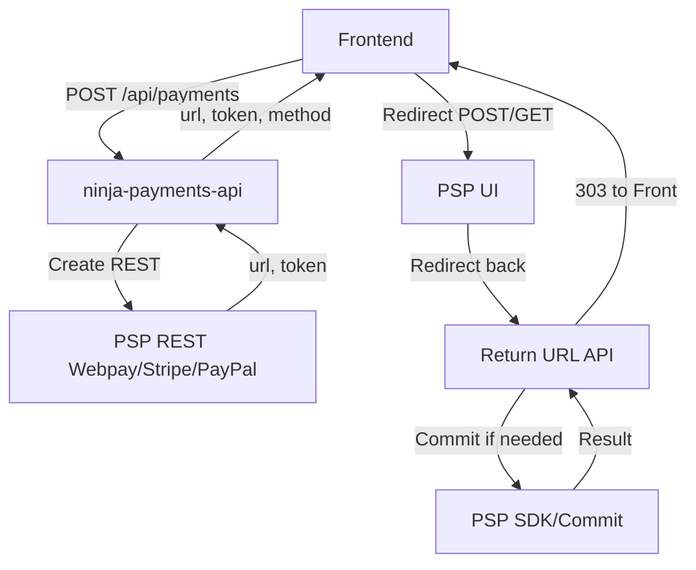
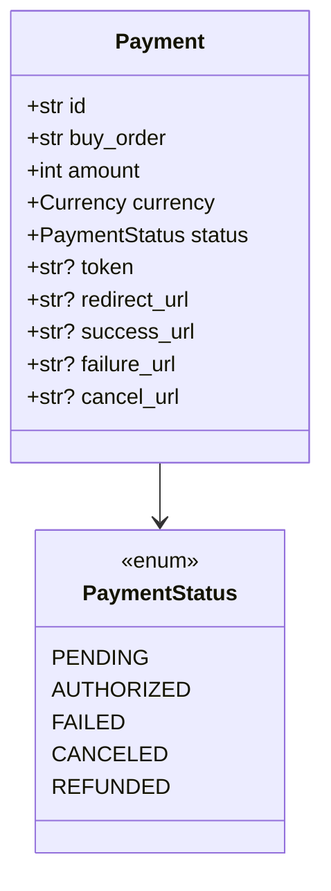
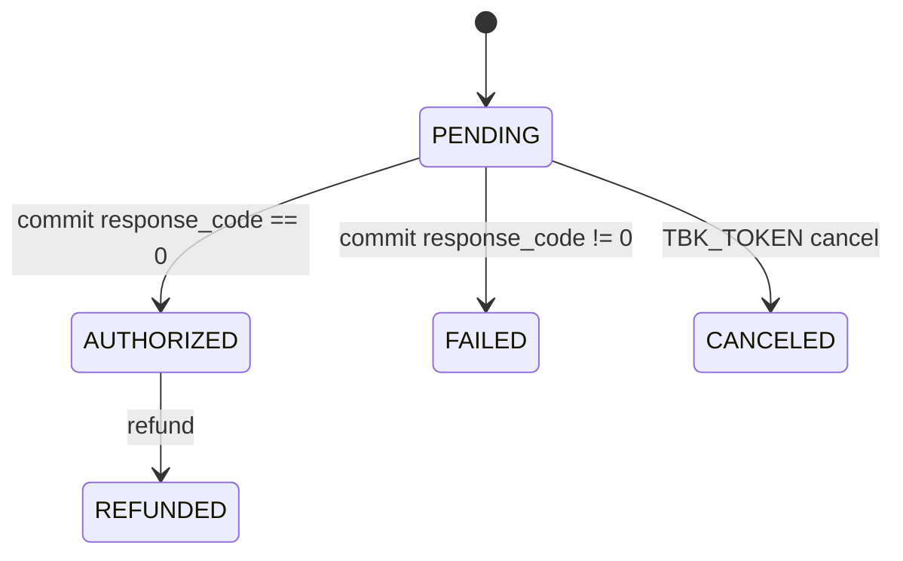
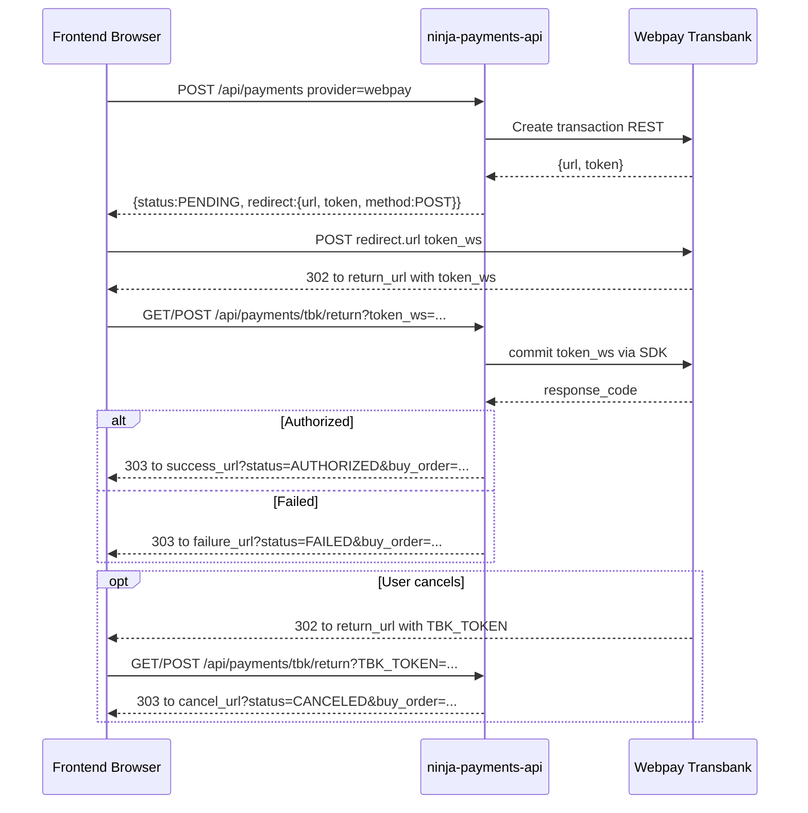
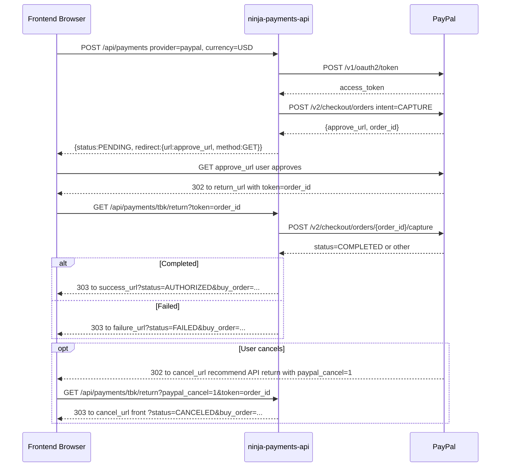
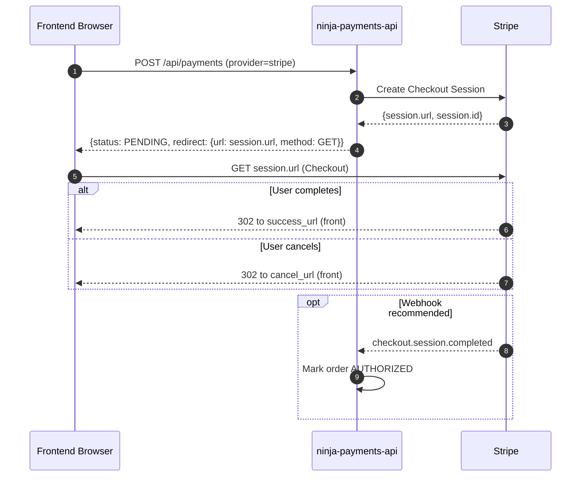

# ninja-payments-api

FastAPI service exposing a minimal payments API using Transbank Webpay Plus.

## Setup

```bash
python -m venv .venv
source .venv/bin/activate || .\.venv\Scripts\activate
pip install -r requirements.txt
cp -n .env.example .env 2>/dev/null || copy .env.example .env
```

## Usage

Create a payment:

```bash
curl -X POST http://localhost:8000/api/payments \
  -H 'Authorization: Bearer testtoken' \
  -H 'Content-Type: application/json' \
  -d '{"buy_order":"o-123","amount":1000,"currency":"CLP","return_url":"http://localhost:8000/api/payments/tbk/return","success_url":"http://localhost:3000/checkout/success","failure_url":"http://localhost:3000/checkout/failure","cancel_url":"http://localhost:3000/checkout/canceled"}'
```

The response contains a token and redirect URL. A minimal auto-post form looks like:

```html
<form id="pay" action="https://webpay.example/" method="POST">
  <input type="hidden" name="token_ws" value="TOKEN" />
</form>
<script>document.getElementById('pay').submit();</script>
```

Transbank will call `/api/payments/tbk/return` with `token_ws` (authorized/failed) or
`TBK_TOKEN` when the user cancels. If you provide `success_url`, `failure_url`,
or `cancel_url`, the API will redirect the browser (303) to those URLs appending
`status` and `buy_order` as query parameters. Otherwise, the API returns a JSON
with the final status.

## Tests

```bash
pytest
```

## Overview

This service exposes a small, opinionated API to create payment transactions against Transbank Webpay Plus (integration environment), handle the browser return from Webpay, and report the final status back to the client. It favors simplicity and clear flows suitable for demos, PoCs, and local development.

Key traits:
- Minimal endpoints: create payment and handle the return.
- Real calls to Transbank integration for creation and commit.
- Optional frontend redirects after return (success/failure/cancel).
- Simple in‑memory store for payment state (ephemeral, dev‑only).
- Bearer token authentication for the create endpoint.
- JSON logging for easy parsing.

## Architecture



Components:
- App: `app/main.py` wires routers and logging.
- Routes: `app/routes/health.py`, `app/routes/payments.py`.
- Service: `app/services/payments_service.py` contains business rules.
- Provider: `app/providers/` contains provider implementations (Webpay, Stripe, PayPal).
- Store: `app/repositories/memory_store.py` keeps state per token in RAM.
- Config: `app/config.py` (Pydantic v2 settings; extra env vars are ignored).

Code map highlights:
- App boot/CORS: app/main.py:11
- Payment routes: app/routes/payments.py:36, app/routes/payments.py:72, app/routes/payments.py:221, app/routes/payments.py:235, app/routes/payments.py:248, app/routes/payments.py:263
- Service methods: app/services/payments_service.py:28, app/services/payments_service.py:102, app/services/payments_service.py:139, app/services/payments_service.py:164, app/services/payments_service.py:173
- Webpay provider: app/providers/transbank_webpay_plus.py:31, app/providers/transbank_webpay_plus.py:56, app/providers/transbank_webpay_plus.py:69, app/providers/transbank_webpay_plus.py:106
- Stripe provider: app/providers/stripe_checkout.py:19, app/providers/stripe_checkout.py:54, app/providers/stripe_checkout.py:95, app/providers/stripe_checkout.py:110
- PayPal provider: app/providers/paypal_checkout.py:19, app/providers/paypal_checkout.py:88, app/providers/paypal_checkout.py:111, app/providers/paypal_checkout.py:138

## Domain & Statuses



State machine:



## Endpoints

1) POST `/api/payments` (Register/Create Payment)
- Auth: `Authorization: Bearer <token>` (default dev token: `dev-token` in `.env.example`).
- Optional: `Idempotency-Key` header to safely retry the same request.
- Body:
  - `buy_order` (string)
  - `amount` (int, > 0)
  - `currency` (string):
    - `CLP` for Webpay (Transbank)
    - `USD` recommended for PayPal Sandbox
  - `return_url` (string): where Webpay will redirect after payment
  - `provider` (string, optional): `webpay` (default), `stripe`, or `paypal`. Unsupported providers return 400.
  - `success_url` (string, optional): where to redirect the browser after an authorized payment
  - `failure_url` (string, optional): where to redirect the browser after a failed payment
  - `cancel_url` (string, optional): where to redirect the browser after a canceled payment

Example request:

```bash
curl -X POST http://localhost:8000/api/payments \
  -H 'Authorization: Bearer dev-token' \
  -H 'Content-Type: application/json' \
  -d '{
    "buy_order":"o-123",
    "amount":1000,
    "currency":"CLP",
    "return_url":"http://localhost:8000/api/payments/tbk/return",
    "provider":"webpay",
    "success_url":"http://localhost:3000/checkout/success",
    "failure_url":"http://localhost:3000/checkout/failure",
    "cancel_url":"http://localhost:3000/checkout/canceled"
  }'
```

Response (example):

```json
{
  "status": "PENDING",
  "redirect": {
    "url": "https://webpay3gint.transbank.cl/webpayserver/initTransaction",
    "token": "01ab...",
    "method": "POST",
    "form_fields": { "token_ws": "01ab..." }
  }
}
```

Frontend then renders and auto‑submits a form to `redirect.url` with `token_ws` (Webpay) or navigates via GET (Stripe/PayPal).

Code references:
- Route definition: app/routes/payments.py:36
- Service logic (create + idempotency): app/services/payments_service.py:28
- Provider selection: app/providers/factory.py:19
- Webpay create (REST): app/providers/transbank_webpay_plus.py:31
- Stripe create (Checkout Session): app/providers/stripe_checkout.py:19
- PayPal create (Orders v2): app/providers/paypal_checkout.py:19

2) GET/POST `/api/payments/tbk/return` (Transbank Return)
- Webpay redirects the user’s browser here with either:
  - `token_ws` when authorized or failed
  - `TBK_TOKEN` when canceled
- Behavior:
  - If `token_ws` exists: the API performs `commit` against Transbank via SDK to finalize the transaction and determine `AUTHORIZED` or `FAILED`.
  - If `TBK_TOKEN` exists: the API marks the transaction as `CANCELED`.
  - If `success_url`/`failure_url`/`cancel_url` were provided on creation, the API responds with a `303 See Other` redirect to the corresponding URL, appending `status` and `buy_order` as query parameters.
  - Otherwise, it returns a JSON body: `{ "status": "AUTHORIZED|FAILED|CANCELED" }`.

Provider-specific notes:
- Webpay (Transbank): return carries `token_ws` or `TBK_TOKEN` and the API performs commit.
- Stripe Checkout: the browser navigates to Stripe and then back to your `success_url`/`cancel_url` directly; use webhooks to confirm status (optional polling via provider `commit`).
- PayPal Checkout: the browser is redirected to PayPal for approval, then back to the API `return_url` with `token` (order id). The API captures the order (commit). For cancel, set `cancel_url` to the API return endpoint with `?paypal_cancel=1` so the API can mark it as `CANCELED` and redirect to your frontend. In Sandbox, use `USD` currency.

Example redirects:
- `http://localhost:3000/checkout/success?status=AUTHORIZED&buy_order=o-123`
- `http://localhost:3000/checkout/failure?status=FAILED&buy_order=o-123`
- `http://localhost:3000/checkout/canceled?status=CANCELED&buy_order=o-123`

Code references:
- Route definition: app/routes/payments.py:72
- Commit service: app/services/payments_service.py:102
- Webpay commit (SDK): app/providers/transbank_webpay_plus.py:56

3) GET `/health`
- Simple liveness check. Returns `{ "status": "ok" }`.

4) POST `/api/payments/stripe/webhook`
- Receives Stripe events, verifies the signature, and updates the payment state based on the Checkout Session id.
- Use for production-grade confirmation of Stripe payments.
- Local dev: `stripe listen --forward-to http://localhost:8000/api/payments/stripe/webhook` and set `STRIPE_WEBHOOK_SECRET`.

5) GET `/api/payments/pending`
- Returns a list of pending transactions (in-memory store) with minimal fields.
- Secured with Bearer token.

6) POST `/api/payments/refresh`
- Body: `{ "tokens": ["..."] }`
- For each token, queries the provider for read-only status when possible (Stripe/PayPal) and updates state. For Webpay, performs a commit to finalize.
- Returns `{ updated: n, results: { token: status } }`.

Example request (JSON):

```json
{ "tokens": ["01ab..."] }
```

Example response (JSON):

```json
{ "updated": 1, "results": { "01ab...": "AUTHORIZED" } }
```

Code references:
- Route definition: app/routes/payments.py:221
- Service refresh logic: app/services/payments_service.py:139
- Webpay commit used for finalize: app/providers/transbank_webpay_plus.py:56

7) POST `/api/payments/status`
- Body: `{ "tokens": ["..."] }`
- Read-only status check. Returns provider-reported statuses without mutating the in-memory store. Values can be `AUTHORIZED`, `FAILED`, `CANCELED`, `PENDING`, or `null` if unknown/unavailable.
  - Webpay: usa `Transaction.status(token)` del SDK y mapea a `AUTHORIZED/FAILED/REFUNDED/PENDING` sin efectos colaterales.

Example request (JSON):

```json
{ "tokens": ["01ab..."] }
```

Example response (JSON):

```json
{ "results": { "01ab...": "AUTHORIZED" } }
```

Code references:
- Route definition: app/routes/payments.py:235
- Service read-only status: app/services/payments_service.py:164
- Webpay status (SDK): app/providers/transbank_webpay_plus.py:69
- Stripe status (Session/PI): app/providers/stripe_checkout.py:95
- PayPal status (Orders v2): app/providers/paypal_checkout.py:111

8) POST `/api/payments/refund`
- Auth: Bearer
- Body: `{ "token": "...", "amount": <int|null> }`
- Issues a refund with the provider associated to the token.
  - Stripe: refunds the PaymentIntent (amount in minor units for decimal currencies; zero-decimal for CLP). If omitted, full refund.
  - PayPal: refunds the latest capture of the Order (amount in major units; Sandbox typically USD). If omitted, full refund.
  - Webpay: refunds/nullifications via REST (amount in CLP). If omitted, defaults to full refund of the original amount.
- Response: `{ "status": "REFUNDED" | current_status }` (the in-memory store is updated to `REFUNDED` on success).

Example request (JSON):

```json
{ "token": "01ab...", "amount": 1000 }
```

Example response (JSON):

```json
{ "status": "REFUNDED" }
```

Code references:
- Route definition: app/routes/payments.py:263
- Service refund logic (defaults full for TBK): app/services/payments_service.py:173
- Webpay refund (REST `/transactions/{token}/refunds`): app/providers/transbank_webpay_plus.py:106
- Stripe refund: app/providers/stripe_checkout.py:110
- PayPal refund: app/providers/paypal_checkout.py:138

9) GET `/api/payments/redirect`
- Auth: Bearer
- Query: `?token=...`
- Returns the redirect information to resume a pending checkout flow:
  - Webpay: `{ url, token, method: POST, form_fields: { token_ws } }`
  - Stripe/PayPal: `{ url, token, method: GET }`

Code references:
- Route definition: app/routes/payments.py:248

### Sequence Diagrams

#### Webpay (Transbank)



#### PayPal (Checkout Orders v2)



#### Stripe (Checkout)



Notes for Stripe Checkout
- The browser returns directly to your `success_url`/`cancel_url` (the API is not in that redirect), so your page will not receive `status` or `buy_order` via query params from the API like Webpay/PayPal.
- Recommended success URL: include the placeholder `{CHECKOUT_SESSION_ID}` so the frontend can read the Session id if needed, e.g. `http://localhost:3000/success.html?session_id={CHECKOUT_SESSION_ID}`.
- To query server state from the success page (optional): call `GET /api/payments/tbk/return?token=<session_id>`. The API will poll Stripe for the session status and return `{ "status": "AUTHORIZED|FAILED" }` as JSON (in addition to your webhook updating server state).
  - Tip: add `&format=json` to force a JSON response from the API and avoid browser redirects.
- En la mayoría de integraciones, Stripe redirige sin `status`/`buy_order` en la URL del front. Esto es esperado; confía en el webhook como fuente de verdad y/o implementa la consulta opcional descrita arriba.

Refund visibility in status (read-only)
- PayPal: `/status` inspecciona las captures y devuelve `REFUNDED` si alguna está refund/partially refunded.
- Webpay: `/status` consulta el SDK; si TBK reporta `REVERSED`/`NULLIFIED`, mapeamos a `REFUNDED`.
- Stripe: `/status` actualmente devuelve `AUTHORIZED` si pagado; los refunds pueden no aparecer como `REFUNDED` aquí. Usa la respuesta del endpoint de refund o el dashboard, o extiende el provider para inspeccionar refunds del PaymentIntent.

## Security

- Authentication: Bearer token on `POST /api/payments` and sensitive endpoints. Default token is configured via env (see below). Requests without a valid token receive HTTP 401.
- Verifier: app/utils/security.py:8
- Idempotency: optional `Idempotency-Key` header. If the same key is reused and the transaction already exists with a known redirect, the API returns the same `redirect` info and status instead of creating a new transaction. Extractor: app/utils/idempotency.py:8
- No card or PII data is handled by your API; Webpay handles sensitive data.

## Configuration

Environment variables (Pydantic settings; case-insensitive):
- `API_BEARER_TOKEN` (default `testtoken` in code, `.env.example` uses `dev-token`)
- `TBK_API_KEY_ID` (integration)
- `TBK_API_KEY_SECRET` (integration)
- `TBK_HOST` (default `https://webpay3gint.transbank.cl`)
- `TBK_API_BASE` (default `/rswebpaytransaction/api/webpay/v1.2`)
- `PROVIDER` (default `transbank`)
- `RETURN_URL` (fallback default: `http://localhost:8000/api/payments/tbk/return`)
- Stripe:
  - `STRIPE_SECRET_KEY` (test/live)
  - `STRIPE_WEBHOOK_SECRET` (if using webhooks)
- PayPal:
  - `PAYPAL_CLIENT_ID` (sandbox/live)
  - `PAYPAL_CLIENT_SECRET` (sandbox/live)
  - `PAYPAL_BASE_URL` (default sandbox: `https://api-m.sandbox.paypal.com`)

Notes:
- Extra keys in `.env` are ignored by design (we use Pydantic v2 with `extra="ignore"`). This allows keeping `.env.example` more comprehensive than current code.
- The code uses Transbank integration credentials and endpoints. Production will require live credentials and ensuring the integration type in the SDK is set appropriately.

## Logging

- JSON logs at INFO level. Formatter: app/logging.py:8
- Whitelisted fields: `buy_order`, `token`, `response_code`, `status`, `idempotency_key`, `endpoint`, `method`, `redirect_to`, `event`, `currency`, `amount`, `provider` (see app/logging.py:18).
- Typical messages: "transaction created", "transaction committed", "webpay status read", "webpay refund executed".

## Testing

- `pytest` runs a smoke test mocking network calls and the Transbank SDK.
- No external connectivity is required to run tests.
- To run: `pytest`.

## Frontend Integration Tips

1) Create the payment on your backend and read `redirect.url` + `token` in response.
2) Render a form targeting `redirect.url` with hidden input `token_ws` = token.
3) Auto-submit the form (or present a pay button).
4) Handle the 303 redirect at your frontend `success_url`/`failure_url`/`cancel_url` and show a status page.
   - For PayPal, set `cancel_url` to the API return endpoint with `?paypal_cancel=1` so the API can mark the payment as canceled and then redirect to your front.
5) Si tu `success_url` se abre sin `?status=...` (p. ej., por proxy o flujo del PSP), tu frontend puede:
   - Consultar `POST /api/payments/status` con el identificador de la transacción (token de Webpay, session_id de Stripe, order_id de PayPal).
   - Si devuelve `null`, como alternativa llamar `POST /api/payments/refresh` para finalizar el estado cuando aplique.
   - Autenticar con el mismo Bearer usado al crear la transacción.

Minimal form example:

```html
<form id="pay" action="https://webpay3gint.transbank.cl/webpayserver/initTransaction" method="POST">
  <input type="hidden" name="token_ws" value="TOKEN" />
  <noscript><button type="submit">Pagar</button></noscript>
</form>
<script>document.getElementById('pay').submit();</script>
```

## Limitations & Next Steps

- Storage is in-memory; states are lost on process restart. For real use, persist to a DB and enforce idempotency with unique constraints.
- Currencies: Webpay requires `CLP`; PayPal Sandbox recomienda `USD`; Stripe soporta múltiples (CLP/ USD, etc.).
- Error handling es mínima; considera errores de dominio 4xx más específicos para producción.
- Providers: Webpay, Stripe y PayPal incluidos. Otros pueden agregarse vía la factory.
- Webhooks: Stripe implementado; opcional expandir a PayPal/otros.

## Postman & OpenAPI

- Import the included collection: `ninja-payments-api.postman_collection.json`.
- Or import the live OpenAPI spec from the running service: `http://localhost:8000/openapi.json`.

## Provider Setup Notes

Stripe (optional)
- Create or use a Stripe account in a supported country; enable Test mode.
- Get `sk_test_…` from Developers → API keys and set `STRIPE_SECRET_KEY`.
- For webhooks in local dev: `stripe listen --forward-to http://localhost:8000/api/payments/stripe/webhook` and set `STRIPE_WEBHOOK_SECRET`.

PayPal (recommended for countries without Stripe)
- Go to https://developer.paypal.com/, create a Developer account and a Sandbox app.
- Get your Sandbox `Client ID` and `Secret` and set `PAYPAL_CLIENT_ID` and `PAYPAL_CLIENT_SECRET`.
- Keep `PAYPAL_BASE_URL` as `https://api-m.sandbox.paypal.com` for sandbox testing.
- In requests, use `provider: "paypal"`. The API will return an approval URL; the frontend redirects there, and PayPal returns to your API `return_url` (commit) or to `cancel_url` (we recommend `.../api/payments/tbk/return?paypal_cancel=1`).

## Repository Scope

This repository contains only the backend Payment API logic: creating transactions, communicating with PSPs (Webpay/Stripe/PayPal), handling the return/commit, status queries, refresh, and refunds. Any demo frontend or reconciliation workers should live in separate repositories.

Notes:
- The API is CORS-enabled for development.
- Frontends should implement their own redirect handling and (optionally) polling or webhooks according to each provider.
- Reconciliation jobs can consume `GET /api/payments/pending`, `POST /api/payments/status`, and `POST /api/payments/refresh` from an external worker service.


## Troubleshooting

- Stripe: la página de éxito queda “Cargando…”
  - Asegúrate de que `success_url` incluya `?session_id={CHECKOUT_SESSION_ID}`.
  - Tu front puede consultar `GET /api/payments/tbk/return?token=<session_id>&format=json` o `POST /api/payments/status` para confirmar estado.
  - Prueba rápido: `curl "http://localhost:8000/api/payments/tbk/return?token=cs_test_...&format=json"`.
  - Verifica el listener del webhook y `STRIPE_WEBHOOK_SECRET`; los logs deben mostrar “stripe webhook received” y “commit completed … AUTHORIZED/FAILED”.

- Stripe webhook no llega
  - `stripe login` y luego `stripe listen --events checkout.session.completed,payment_intent.payment_failed --forward-to http://localhost:8000/api/payments/stripe/webhook`.
  - Copia `whsec_...` a `.env` y reinicia la API.
  - Dispara un evento: `stripe trigger checkout.session.completed`.

- PayPal 422 Unprocessable Entity
  - Usa `currency: "USD"` en Sandbox y un `amount` pequeño (ej. 10).
  - Verifica `PAYPAL_CLIENT_ID` y `PAYPAL_CLIENT_SECRET`.

- Webpay 401 Unauthorized al crear
  - El header `Authorization: Bearer …` debe coincidir con `API_BEARER_TOKEN` del `.env`.
